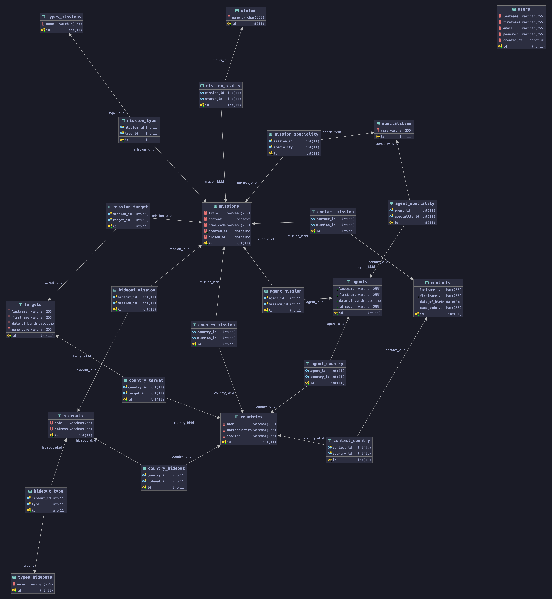

# managerKGB

## Objectif

### Livrable attendu pour l’examen de ce bloc

L’objectif est de créer un site internet permettant la gestion des données du KGB.
Consignes techniques :
* Le site sera réalisé en HTML5, CSS3, JS ES6+ et PHP 7.
* Vous pouvez utiliser un Framework CSS de votre choix.
* Vous pouvez utiliser les librairies JS / CSS de votre choix, jQuery inclus.
* Vous ne pouvez pas utiliser de Framework JS (React, Angular, etc.), de Framework PHP (Symfony, etc.).

### Contexte du projet : la BDD

* Les agents ont un nom, un prénom, une date de naissance, un code d'identification, une nationalité, 1 ou plusieurs spécialités.
* Les cibles ont un nom, un prénom, une date de naissance, un nom de code, une nationalité.
* Les contacts ont un nom, un prénom, une date de naissance, un nom de code, une nationalité.
* Les planques ont un code, une adresse, un pays, un type.
* Les missions ont un titre, une description, un nom de code, un pays, 1 ou plusieurs agents, 1 ou plusieurs contacts, 1 ou plusieurs cibles, un type de mission (Surveillance, Assassinat, Infiltration …), un statut (En préparation, en cours, terminé, échec), 0 ou plusieurs planques, 1 spécialité requise, date de début, date de fin.
* Les administrateurs ont un nom, un prénom, une adresse mail, un mot de passe, une date de création.

#### Règle métier :

* Sur une mission, la ou les cibles ne peuvent pas avoir la même nationalité que le ou les agents.
* Sur une mission, les contacts sont obligatoirement de la nationalité du pays de la mission.
* Sur une mission, la planque est obligatoirement dans le même pays que la mission.
* Sur une mission, il faut assigner au moins 1 agent disposant de la spécialité requise.

### Modalités Pédagogiques

Il vous est demandé de créer la base de données selon cette description. Tous les champs devront avoir les bons types, avec optimisation. Il faut également créer les liens entre les différentes tables. Certaines colonnes sont peut-être manquantes et nécessaires à votre développement, à vous de les fournir. Aucun jeu de données n’est fourni. Il faudra présenter un schéma de conception (MCD/MLD). Il faudra créer un script de création de la base, facilement exécutable pour une création rapide.
Il vous est ensuite demandé de créer une interface front-office, accessible à tous, permettant de consulter la liste de toutes les missions, ainsi qu’une page permettant de voir le détail d’une mission.
De plus, il faudra créer une interface back-office, uniquement accessible aux utilisateurs de rôle ADMIN, qui va permettre de gérer la base de données de la bibliothèque. Ce back-office va permettre de lister, créer, modifier et supprimer chaque donnée des différentes tables, grâce à des formulaires et des tableaux. Il faut que ces pages ne soient pas accessibles à tout le monde ! Il faudra donc créer une page de connexion et de déconnexion (pas de page d'inscription).
Il faut réaliser le projet en programmation orienté objet, de type MVC (Model Vue Controller). Chaque table de la base de données sera représentée par un objet PHP.

#### BONUS :

* Intégrer un système de pagination sur toutes les listes du site (front-office / back-office)
* Ajouter un système de filtres et de tri sur toutes les listes du site
* Ajouter un champ de recherche pour une mission
* Utiliser l'AJAX pour envoyer et récupérer des données vers votre backend de façon asynchrone, sans avoir à recharger la page. 

## Diagramme



## SQl de Base

```mysql
create table agents
(
    id            int auto_increment
        primary key,
    lastname      varchar(255) not null,
    firstname     varchar(255) not null,
    date_of_birth datetime     not null,
    id_code       varchar(255) not null
);

create table contacts
(
    id            int auto_increment
        primary key,
    lastname      varchar(255) null,
    firstname     varchar(255) not null,
    date_of_birth datetime     null,
    name_code     varchar(255) null
);

create table countries
(
    id            int auto_increment
        primary key,
    name          varchar(255) null,
    nationalities varchar(255) null,
    iso3166       varchar(255) null
);

create table agent_country
(
    id         int auto_increment
        primary key,
    agent_id   int null,
    country_id int null,
    constraint agent_country_agents_id_fk
        foreign key (agent_id) references agents (id),
    constraint agent_country_countries_id_fk
        foreign key (country_id) references countries (id)
);

create table contact_country
(
    id         int auto_increment
        primary key,
    contact_id int null,
    country_id int null,
    constraint contact_country_contacts_id_fk
        foreign key (contact_id) references contacts (id),
    constraint contact_country_countries_id_fk
        foreign key (country_id) references countries (id)
);

create table hideouts
(
    id      int auto_increment
        primary key,
    code    varchar(255) null,
    address varchar(255) null
);

create table country_hideout
(
    id         int auto_increment
        primary key,
    country_id int null,
    hideout_id int null,
    constraint country_hideout_countries_id_fk
        foreign key (country_id) references countries (id),
    constraint country_hideout_hideouts_id_fk
        foreign key (hideout_id) references hideouts (id)
);

create table missions
(
    id         int auto_increment
        primary key,
    title      varchar(255)                       null,
    content    longtext                           null,
    name_code  varchar(255)                       null,
    created_at datetime default CURRENT_TIMESTAMP not null,
    closed_at  datetime default CURRENT_TIMESTAMP null
);

create table agent_mission
(
    id         int auto_increment
        primary key,
    agent_id   int null,
    mission_id int null,
    constraint agent_mission_agents_id_fk
        foreign key (agent_id) references agents (id),
    constraint agent_mission_missions_id_fk
        foreign key (mission_id) references missions (id)
);

create table contact_mission
(
    id         int auto_increment
        primary key,
    contact_id int null,
    mission_id int null,
    constraint contact_mission_contacts_id_fk
        foreign key (contact_id) references contacts (id),
    constraint contact_mission_missions_id_fk
        foreign key (mission_id) references missions (id)
);

create table country_mission
(
    id         int auto_increment
        primary key,
    country_id int null,
    mission_id int null,
    constraint country_mission_countries_id_fk
        foreign key (country_id) references countries (id),
    constraint country_mission_missions_id_fk
        foreign key (mission_id) references missions (id)
);

create table hideout_mission
(
    id         int auto_increment
        primary key,
    hideout_id int null,
    mission_id int null,
    constraint hideout_mission_hideouts_id_fk
        foreign key (hideout_id) references hideouts (id),
    constraint hideout_mission_missions_id_fk
        foreign key (mission_id) references missions (id)
);

create table specialities
(
    id   int auto_increment
        primary key,
    name varchar(255) null
);

create table agent_speciality
(
    id            int auto_increment
        primary key,
    agent_id      int null,
    speciality_id int null,
    constraint agent_speciality_agents_id_fk
        foreign key (agent_id) references agents (id),
    constraint agent_speciality_specialities_id_fk
        foreign key (speciality_id) references specialities (id)
);

create table mission_speciality
(
    id         int auto_increment
        primary key,
    mission_id int null,
    speciality int null,
    constraint mission_speciality_missions_id_fk
        foreign key (mission_id) references missions (id),
    constraint mission_speciality_specialities_id_fk
        foreign key (speciality) references specialities (id)
);

create table status
(
    id   int auto_increment
        primary key,
    name varchar(255) null
);

create table mission_status
(
    id         int auto_increment
        primary key,
    mission_id int null,
    status_id  int null,
    constraint mission_status_missions_id_fk
        foreign key (mission_id) references missions (id),
    constraint mission_status_status_id_fk
        foreign key (status_id) references status (id)
);

create table targets
(
    id            int auto_increment
        primary key,
    lastname      varchar(255) null,
    firstname     varchar(255) null,
    date_of_birth datetime     null,
    name_code     varchar(255) null
);

create table country_target
(
    id         int auto_increment
        primary key,
    country_id int null,
    target_id  int null,
    constraint country_target_countries_id_fk
        foreign key (country_id) references countries (id),
    constraint country_target_targets_id_fk
        foreign key (target_id) references targets (id)
);

create table mission_target
(
    id         int auto_increment
        primary key,
    mission_id int null,
    target_id  int null,
    constraint mission_target_missions_id_fk
        foreign key (mission_id) references missions (id),
    constraint mission_target_targets_id_fk
        foreign key (target_id) references targets (id)
);

create table types_hideouts
(
    id   int auto_increment
        primary key,
    name varchar(255) null
);

create table hideout_type
(
    id         int auto_increment
        primary key,
    hideout_id int null,
    type       int null,
    constraint hideout_type_hideouts_id_fk
        foreign key (hideout_id) references hideouts (id),
    constraint hideout_type_types_hideouts_id_fk
        foreign key (type) references types_hideouts (id)
);

create table types_missions
(
    id   int auto_increment
        primary key,
    name varchar(255) null
);

create table mission_type
(
    id         int auto_increment
        primary key,
    mission_id int null,
    type_id    int null,
    constraint mission_type_missions_id_fk
        foreign key (mission_id) references missions (id),
    constraint mission_type_types_missions_id_fk
        foreign key (type_id) references types_missions (id)
);

create table users
(
    id         int auto_increment
        primary key,
    lastname   varchar(255)                       null,
    firstname  varchar(255)                       null,
    email      varchar(255)                       null,
    password   varchar(255)                       null,
    created_at datetime default CURRENT_TIMESTAMP null
);

```

## exemple de fichier 'connect.php' à la racine du projet

```phpregexp
<?php
const DB_NAME = 'maBase';
const DB_HOST = 'host';
const DB_USER = 'utilisateur';
const DB_PWD = 'mot de passe';
```
